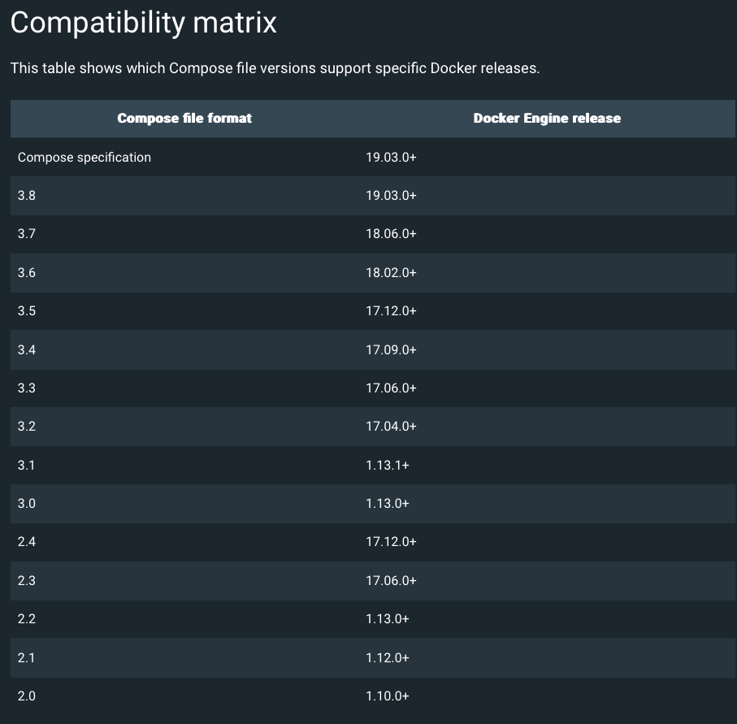
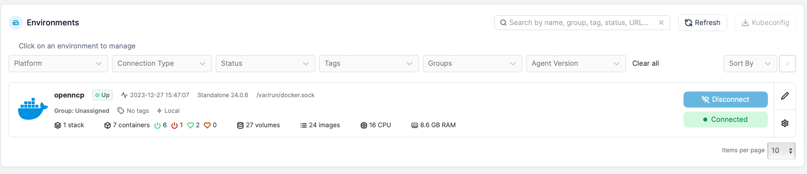
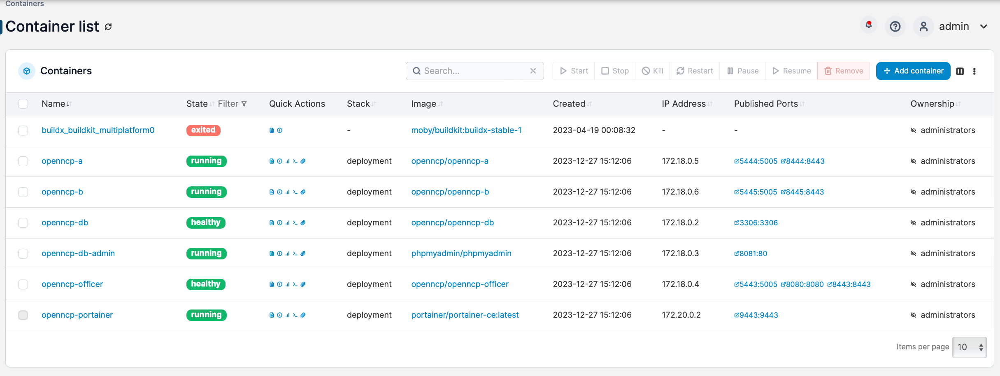
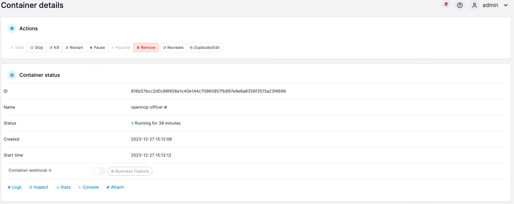
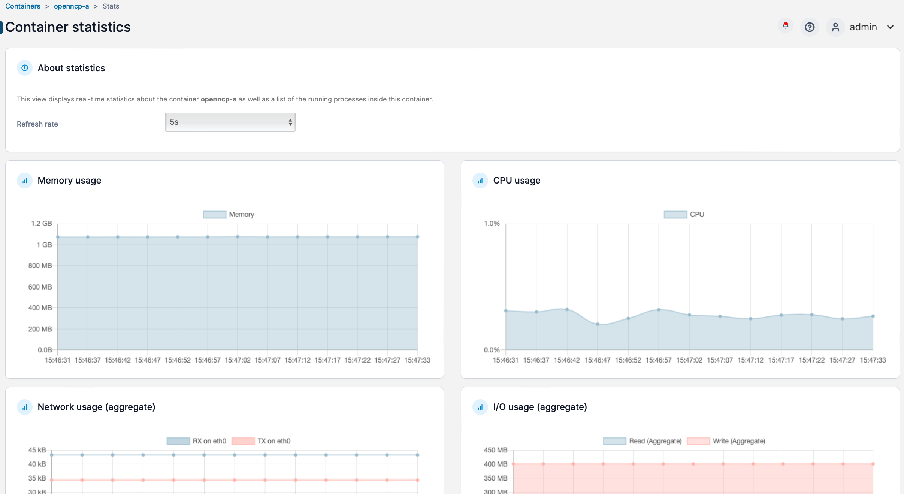
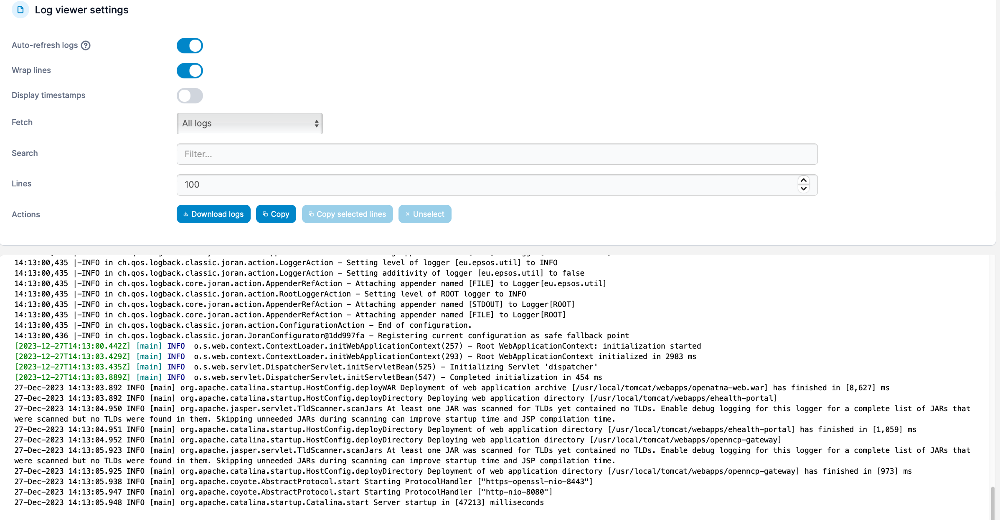
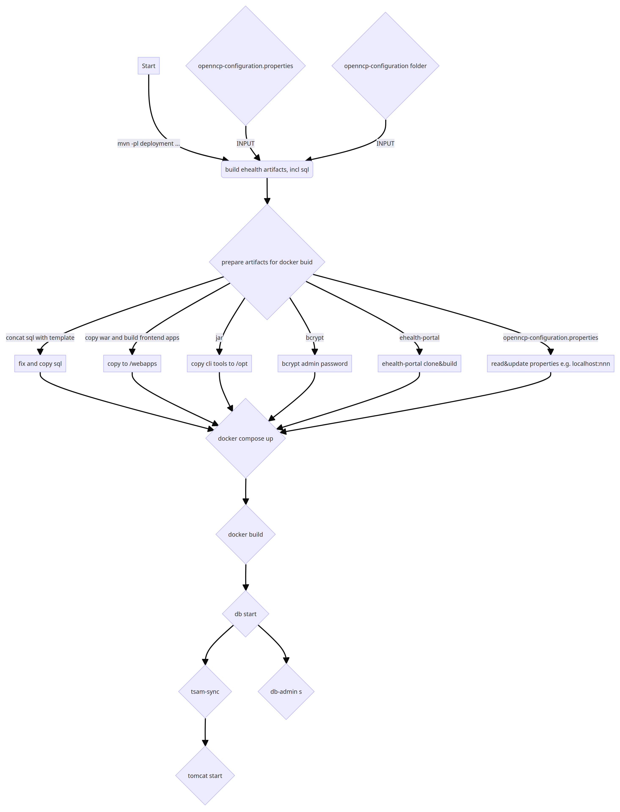

# OpenNCP Docker and Docker-Compose Deployment Guide

This documentation serves as a comprehensive guide for deploying and managing the openNCP using Docker and Docker-Compose. Leveraging containerization, this guide ensures a consistent and reproducible environment across various platforms.
The document covers key aspects of the deployment lifecycle, including configuration, management, and monitoring of the Docker and Docker-Compose stack.

<!-- TOC -->
* [OpenNCP Docker and Docker-Compose Deployment Guide](#openncp-docker-and-docker-compose-deployment-guide)
* [Environment Setup](#environment-setup)
  * [Prerequisites](#prerequisites)
  * [Install Docker](#install-docker)
  * [Install Docker-Compose](#install-docker-compose)
* [Configuration](#configuration)
  * [Docker-Compose Reference Configuration](#docker-compose-reference-configuration)
  * [Environment Variables](#environment-variables)
    * [Inline](#inline)
    * [Direct](#direct)
    * [Environment File](#environment-file)
    * [Multiple Environment Files](#multiple-environment-files)
    * [Inline Variable Substitution](#inline-variable-substitution)
    * [Host environment](#host-environment)
    * [Reference](#reference)
* [Management](#management)
  * [Common Tasks](#common-tasks)
    * [Starting Containers](#starting-containers)
    * [Stopping Containers](#stopping-containers)
    * [Viewing Container Logs](#viewing-container-logs)
  * [Scaling Services](#scaling-services)
    * [Checking Container Status](#checking-container-status)
  * [Troubleshooting](#troubleshooting)
    * [Inspecting Containers](#inspecting-containers)
    * [Removing Containers](#removing-containers)
    * [Rebuilding Images](#rebuilding-images)
    * [Network Issues](#network-issues)
  * [Container Management with Portainer](#container-management-with-portainer)
    * [Portainer compose deployment with admin password preset](#portainer-compose-deployment-with-admin-password-preset)
      * [`--admin-password-file`](#--admin-password-file)
      * [`--admin-password`](#--admin-password)
* [Monitoring](#monitoring)
  * [Health Checks](#health-checks)
    * [Using Portainer to Monitor Container Stats](#using-portainer-to-monitor-container-stats)
  * [Logging](#logging)
    * [Using Docker Compose to View Container Logs](#using-docker-compose-to-view-container-logs)
    * [Using Portainer to View Container Logs](#using-portainer-to-view-container-logs)
* [Building](#building)
* [Running](#running)
  * [Optional Services Optional via Profiles](#optional-services-optional-via-profiles)
    * [OpenNCP using an external database](#openncp-using-an-external-database)
    * [OpenNCP using the included database](#openncp-using-the-included-database)
    * [Tips](#tips)
    * [Multiple enabled profiles](#multiple-enabled-profiles)
  * [Executing](#executing)
    * [Cleanup](#cleanup)
    * [TSAM Sync](#tsam-sync)
      * [Production URLs](#production-urls)
      * [Acceptance URLs](#acceptance-urls)
      * [Training URLs](#training-urls)
    * [TSAM Exporter](#tsam-exporter)
    * [Deploy a new web application](#deploy-a-new-web-application)
    * [Undeploy an existing web application](#undeploy-an-existing-web-application)
<!-- TOC -->

# Environment Setup


## Prerequisites

Developed and tested with the following versions. 

**Docker 24.x**

**Docker-compose 2.23.x**
**Docker-compose 1.29.x**

The compose specification used in the reference and example docker-compose.yml files is `3.0` or `3` (i.e. 3.0 is assumed if minor version is not given)




## Install Docker

Follow the [official Docker installation guide](https://docs.docker.com/get-docker/) to set up Docker on your system.

## Install Docker-Compose

Install Docker-Compose by referring to the [Docker-Compose installation documentation](https://docs.docker.com/compose/install/).

# Configuration

## Docker-Compose Reference Configuration

Customize the following OpenNCP `docker-compose.yml` reference file to adapt the deployment to your specific requirements. The document provides insights into configuring environment variables, volume mounts, and network settings.

Some features to highlight from the OpenNCP `docker-compose.yml` reference file are as follows:

- Start Order is as follows
  - CLI Tool to load the OpenNCP properties from the configuration file into the database, only on the first startup
  - OpenNCP-Officer
  - OpenNCP-A and OpenNCP-B Tomcat
- OpenNCP-A,-B and -Officer Tomcats are using the same local volume mapping for the logs
- Database and Management Service are optional and must be enabled vie standard compose `--profiles`
- Environment Variables are used for customization, and they all begin with an `OPENNCP_` prefix


```yaml
version: "3.0"

services:

  openncp-db:
    image: openncp/openncp-db
    container_name: 'openncp-db'
    restart: always
    environment:
      MYSQL_USER: ${OPENNCP_DATABASE_USER}
      MYSQL_PASSWORD: ${OPENNCP_DATABASE_PASSWORD}
      MYSQL_ROOT_PASSWORD: ${OPENNCP_DATABASE_ROOT_PASSWORD}
    ports:
      - '3306:3306'
    expose:
      - '3306'
    command: --default-time-zone=Europe/Vienna
    volumes:
      - openncp-db-volume:/var/lib/mysql
    healthcheck:
      test: ["CMD", "healthcheck.sh", "--su-mysql", "--connect"]
      interval: 5s
      timeout: 60s
      retries: 10
    networks:
      bridge:
        aliases:
          - openncp-db
    profiles:
      - database

  openncp-officer:
    image: openncp/openncp-officer
    container_name: 'openncp-officer'
    environment:
      OPENNCP_PROPERTIES_FILE: '/opt/openncp-configuration/openncp-configuration.properties'
    depends_on:
      openncp-db:
        condition: service_healthy
    volumes:
      - "./logs:/usr/local/tomcat/logs"
      - "$OPENNCP_CONFIGURATION:/opt/openncp-configuration"
    healthcheck:
      test: ["CMD", "curl", "-k", "-s", "-f", "-i", "https://localhost:8443/openncp-gateway/"]
      interval: 5s
      timeout: 1s
      retries: 3
      start_period: 1m
    ports:
      - "8443:8443"
      - "5443:5005"
    networks:
      bridge:
        aliases:
          - openncp-officer

  openncp-a:
    image: openncp/openncp-a
    container_name: 'openncp-a'
    depends_on:
      openncp-db:
        condition: service_healthy
      openncp-officer:
        condition: service_healthy
    volumes:
      - "./logs:/usr/local/tomcat/logs"
      - "$OPENNCP_CONFIGURATION:/opt/openncp-configuration"
    ports:
      - "8444:8443"
      - "5444:5005"
    networks:
      bridge:
        aliases:
          - openncp-a

  openncp-b:
    image: openncp/openncp-b
    container_name: 'openncp-b'
    depends_on:
      openncp-db:
        condition: service_healthy
      openncp-officer:
        condition: service_healthy
    volumes:
      - "./logs:/usr/local/tomcat/logs"
      - "$OPENNCP_CONFIGURATION:/opt/openncp-configuration"
    ports:
      - "8445:8443"
      - "5445:5005"

    networks:
      bridge:
        aliases:
          - openncp-b

  openncp-db-admin:
    image: phpmyadmin/phpmyadmin
    container_name: 'openncp-db-admin'
    expose:
      - "8081"
    ports:
      - "8081:80"
    environment:
      - PMA_HOST=db
      - PMA_PORT=3306
      - PMA_ARBITRARY=1
    links:
      - openncp-db
    networks:
      bridge:
        aliases:
          - openncp-db-admin
    profiles:
      - database

  portainer:
    image: portainer/portainer-ce:latest
    container_name: openncp-portainer
    command: --admin-password '$$2y$$05$$rOYOQDvL.szwEyRROYr51uVmVOJAX.J1YMIMmmYCnPbsYHbLbfwn'
    ports:
      - 9443:9443
    volumes:
      - openncp-portainer-volume:/data
      - /var/run/docker.sock:/var/run/docker.sock
    restart: unless-stopped
    profiles:
      - management

volumes:
  openncp-portainer-volume:
    driver: local
  openncp-db-volume:
    driver: local

networks:
  bridge:
    driver: bridge
```

## Environment Variables

In Docker Compose, configuring environment variables is crucial for managing application settings and ensuring flexibility across different environments. There are multiple ways to set the values of environment variables within a `docker-compose.yml` file:

### Inline
Define environment variables at the top of the `docker-compose.yml` file using the `variables` key. This centralizes variable definitions and makes them easily accessible for all services.

   ```yaml
   version: '3'
   variables:
     MYSQL_ROOT_PASSWORD: mysecretpassword

   services:
     web:
       image: openncp/openncp-db
       environment:
         - MYSQL_ROOT_PASSWORD=${MYSQL_ROOT_PASSWORD}
   ```

### Direct

Alternatively, define environment variables directly within the service definition using the `environment` key. This method is straightforward and allows for inline specification of variable values.

   ```yaml
   services:
     web:
       image: openncp/openncp-db
       environment:
         - MYSQL_ROOT_PASSWORD=mysecretpassword
   ```

### Environment File
Docker Compose allows you to manage environment variables easily using a `.env` file. Follow these steps to configure environment variables for your Docker Compose project:

**Create a `.env` File**

In the root directory of your Docker Compose project, create a file named `.env`.

**Define Variables in `.env`**

Open the `.env` file and define your environment variables using the `KEY=VALUE` syntax. For example:

```bash
OPENNCP_CONFIGURATION=./openncp-configuration
OPENNCP_DATABASE_USER=openncp
OPENNCP_DATABASE_PASSWORD=openncp1234
OPENNCP_DATABASE_ROOT_PASSWORD=openncp1234
OPENNCP_JDBC_DATASOURCE_CLASSNAME=org.mariadb.jdbc.MariaDbDataSource
OPENNCP_PROPERTIES_JDBC_URL=jdbc:mariadb://openncp-db:3306/ehealth_properties?allowPublicKeyRetrieval=true&useUnicode=true&characterEncoding=utf-8&useSSL=false
OPENNCP_PROPERTIES_JDBC_USER=openncp
OPENNCP_PROPERTIES_JDBC_PASSWORD=openncp1234
OPENNCP_ATNA_JDBC_URL=jdbc:mariadb://openncp-db:3306/ehealth_atna?allowPublicKeyRetrieval=true&useUnicode=true&characterEncoding=utf-8&useSSL=false
OPENNCP_ATNA_JDBC_USER=openncp
OPENNCP_ATNA_JDBC_PASSWORD=openncp1234
OPENNCP_TSAM_JDBC_URL=jdbc:mariadb://openncp-db:3306/ehealth_ltrdb?allowPublicKeyRetrieval=true&useUnicode=true&characterEncoding=utf-8&useSSL=false
OPENNCP_TSAM_JDBC_USER=openncp
OPENNCP_TSAM_JDBC_PASSWORD=openncp1234
OPENNCP_EADC_JDBC_URL=jdbc:mariadb://openncp-db:3306/ehealth_eadc?allowPublicKeyRetrieval=true&useUnicode=true&characterEncoding=utf-8&useSSL=false
OPENNCP_EADC_JDBC_USER=openncp
OPENNCP_EADC_JDBC_PASSWORD=openncp1234
```

**Reference Variables in `docker-compose.yml`**

In your `docker-compose.yml` file, reference the defined environment variables using the `${VARIABLE_NAME}` syntax. For instance:
```yaml
     version: '3'
     services:
       openncp-db:
         image: openncp/openncp-db
         container_name: 'openncp-db' 
         restart: always
         environment:
           MYSQL_USER: ${OPENNCP_DATABASE_USER}
           MYSQL_PASSWORD: ${OPENNCP_DATABASE_PASSWORD} 
           MYSQL_ROOT_PASSWORD: ${OPENNCP_DATABASE_ROOT_PASSWORD}
```
**Run Docker Compose**

Run your Docker Compose configuration using the following command:
```bash
     docker-compose up
```

Docker Compose will automatically read the values from the `.env` file and inject them into the specified services.
Now, your Docker Compose environment is configured with the specified environment variables, providing a convenient and centralized way to manage configuration settings for your openncp containers.

### Multiple Environment Files
Store environment variables in separate files (e.g., `.env`, `.env.override`) and reference them using the `env_file` key. This approach allows you to override variables from earlier files.

   ```yaml
   services:
     web:
       image: openncp/openncp-db
       env_file:
         - .env
         - .env.override
   ```
**CLI Option:**
   ```bash
   docker-compose --env-file .env --env-file .env.override up
   ```

In this example, the `web` service references multiple environment files. Variables from `.env.override` will override those from `.env`.

### Inline Variable Substitution

Utilize variable substitution directly within the `docker-compose.yml` file, allowing for dynamic values and conditional configurations. This approach is useful for scenarios where variable values may change based on conditions or external factors.

   ```yaml
   services:
     web:
       image: openncp/openncp-db
       environment:
         - API_URL=${API_URL:-https://api.example.com}
   ```
**CLI Option:**
   ```bash
   docker-compose up -e API_URL=https://api.example.com
   ```

### Host environment

Pass environment variables directly from the host environment when running `docker-compose` commands. This method is beneficial for runtime configuration without modifying the `docker-compose.yml` file.

   ```bash
   API_URL=https://api.example.com docker-compose up
   ```

### Reference

The following ENV variable are used to configure the path to the `EPSOS_PATH` folder, the server mode and database connection details.

| Name                              | Default                                                                           | Required | Description                                                                                                                                                                                                                                                                                                                                                                                                                                                                                                                                                                                                                                                                                         |
|-----------------------------------|-----------------------------------------------------------------------------------|----------|-----------------------------------------------------------------------------------------------------------------------------------------------------------------------------------------------------------------------------------------------------------------------------------------------------------------------------------------------------------------------------------------------------------------------------------------------------------------------------------------------------------------------------------------------------------------------------------------------------------------------------------------------------------------------------------------------------|
| OPENNCP_CONFIGURATION             | ./openncp-configuration                                                           |          | The `OPENNCP_CONFIGURATION=./openncp-configuration` property specifies the local directory ./openncp-configuration for volume mapping in a Docker Compose setup, enabling seamless synchronization of OpenNCP configuration files between the host machine and the running Docker container. This facilitates flexible and straightforward configuration management during OpenNCP deployment.                                                                                                                                                                                                                                                                                                      |
| OPENNCP_SERVER_EHEALTH_MODE       | PPT                                                                               |          | The `OPENNCP_SERVER_EHEALTH_MODE` controls the central services (e.g. SMP, TSAM) and used network (e.g. Internet vs TESTA) required for configurations and terminologies. A full list of the OpenNCP properties can be found here: [OpenNCP properties](https://webgate.ec.europa.eu/fpfis/wikis/display/EHDSI/OpenNCP+properties)                                                                                                                                                                                                                                                                                                                                                                  |
| OPENNCP_JAVA_VM_PROPERTIES        |                                                                                   |          | The `OPENNCP_JAVA_VM_PROPERTIES` environment variable allows users to configure Java Virtual Machine (JVM) options for the Tomcat server. Setting `OPENNCP_JAVA_VM_PROPERTIES` is useful for customizing JVM parameters, such as heap size or system properties, to optimize Tomcat's performance based on specific application requirements.                                                                                                                                                                                                                                                                                                                                                       |
| OPENNCP_JDBC_DATASOURCE_CLASSNAME | org.mariadb.jdbc.MariaDbDataSource                                                |          | The `OPENNCP_JDBC_DATASOURCE_CLASSNAME=org.mariadb.jdbc.MariaDbDataSource` property specifies the JDBC (Java Database Connectivity) data source class name for MariaDB in a Tomcat `server.xml` resource element. This class, `org.mariadb.jdbc.MariaDbDataSource`, represents the MariaDB implementation of the `javax.sql.DataSource` interface, providing the necessary functionalities for database connectivity and interaction within the Tomcat server.                                                                                                                                                                                                                                      |
| OPENNCP_PROPERTIES_JDBC_URL       | jdbc:mariadb://openncp-db:3306/ehealth_properties?allowPublicKeyRetrieval=true... |          | The `OPENNCP_PROPERTIES_JDBC_URL` property defines the JDBC (Java Database Connectivity) URL for a data source in a Tomcat `server.xml` file. This URL, typically configured as `jdbc:mariadb://openncp-db:3306/ehealth_properties?allowPublicKeyRetrieval=true&useUnicode=true&characterEncoding=utf-8&useSSL=false`, specifies the connection details to the MariaDB database named `ehealth_properties`, allowing the Tomcat server to establish a connection with the designated database server at `openncp-db` on port `3306`. The additional URL parameters ensure specific connection settings, such as allowing public key retrieval, using Unicode character encoding, and disabling SSL. |
| OPENNCP_PROPERTIES_JDBC_USER      | openncp                                                                           |          | The `OPENNCP_PROPERTIES_JDBC_USER` property specifies the username for the JDBC data source in a Tomcat `server.xml` file. This property, such as `openncp`, identifies the user credential used by the Tomcat server to authenticate and establish a connection with the MariaDB database configured in the corresponding JDBC resource element.                                                                                                                                                                                                                                                                                                                                                   |
| OPENNCP_PROPERTIES_JDBC_PASSWORD  | openncp1234                                                                       |          | The `OPENNCP_PROPERTIES_JDBC_PASSWORD` property in a Tomcat `server.xml` file defines the password associated with the JDBC data source. This property, for instance, `openncp1234`, represents the confidential credential required for authentication when establishing a connection between the Tomcat server and the specified MariaDB database in the corresponding JDBC resource element.                                                                                                                                                                                                                                                                                                     |
| OPENNCP_ATNA_JDBC_URL             | jdbc:mariadb://openncp-db:3306/ehealth_atna?allowPublicKeyRetrieval=true&...      |          | s.a.                                                                                                                                                                                                                                                                                                                                                                                                                                                                                                                                                                                                                                                                                                |
| OPENNCP_ATNA_JDBC_USER            | openncp                                                                           |          | s.a.                                                                                                                                                                                                                                                                                                                                                                                                                                                                                                                                                                                                                                                                                                |
| OPENNCP_ATNA_JDBC_PASSWORD        | openncp1234                                                                       |          | s.a.                                                                                                                                                                                                                                                                                                                                                                                                                                                                                                                                                                                                                                                                                                |
| OPENNCP_TSAM_JDBC_URL             | jdbc:mariadb://openncp-db:3306/ehealth_ltrdb?allowPublicKeyRetrieval=true&...     |          | s.a.                                                                                                                                                                                                                                                                                                                                                                                                                                                                                                                                                                                                                                                                                                |
| OPENNCP_TSAM_JDBC_USER            | openncp                                                                           |          | s.a.                                                                                                                                                                                                                                                                                                                                                                                                                                                                                                                                                                                                                                                                                                |
| OPENNCP_TSAM_JDBC_PASSWORD        | openncp1234                                                                       |          | s.a.                                                                                                                                                                                                                                                                                                                                                                                                                                                                                                                                                                                                                                                                                                |
| OPENNCP_EADC_JDBC_URL             | jdbc:mariadb://openncp-db:3306/ehealth_eadc?allowPublicKeyRetrieval=true&...      |          | s.a.                                                                                                                                                                                                                                                                                                                                                                                                                                                                                                                                                                                                                                                                                                |
| OPENNCP_EADC_JDBC_USER            | openncp                                                                           |          | s.a.                                                                                                                                                                                                                                                                                                                                                                                                                                                                                                                                                                                                                                                                                                |
| OPENNCP_EADC_JDBC_PASSWORD        | openncp1234                                                                       |          | s.a.                                                                                                                                                                                                                                                                                                                                                                                                                                                                                                                                                                                                                                                                                                |
| OPENNCP_TOMCAT_HOSTNAME           | localhost                                                                         |          | [Tomcat Server Configuration Reference](https://tomcat.apache.org/tomcat-9.0-doc/config/host.html)                                                                                                                                                                                                                                                                                                                                                                                                                                                                                                                                                                                                  |
| OPENNCP_TOMCAT_HOSTNAME_ALIAS     |                                                                                   |          | [Tomcat Server Configuration Reference](https://tomcat.apache.org/tomcat-9.0-doc/config/host.html)                                                                                                                                                                                                                                                                                                                                                                                                                                                                                                                                                                                                  |

These approaches provide a range of options for configuring environment variables in Docker Compose, catering to different use cases and security considerations. Choosing the right method depends on the specific requirements of your application and the desired level of configuration management. Always consider best practices for handling sensitive information, especially in production environments.
Feel free to adapt this documentation to fit the specifics of your Docker Compose openncp stack and its environment variable requirements.


# Management

Docker Compose is a tool for defining and running multi-container Docker applications. It allows you to describe the services, networks, and volumes required for your application in a `docker-compose.yml` file. This guide provides an overview of common tasks and troubleshooting tips when managing containers with Docker Compose.


## Common Tasks

### Starting Containers

To start containers defined in the `docker-compose.yml` file:

```bash
docker-compose up -d
```

The `-d` flag runs containers in the background.

### Stopping Containers

To stop and remove containers:

```bash
docker-compose down
```

### Viewing Container Logs

To view logs of running containers:

```bash
docker-compose logs
```

Add the service name to view logs for a specific service:

```bash
docker-compose logs <service_name>
```

## Scaling Services

Discover how to scale services dynamically to meet varying workloads:

```bash
docker-compose up -d --scale app=3
```

### Checking Container Status

List the status of services:

```bash
docker-compose ps
```

## Troubleshooting

### Inspecting Containers

Inspect container details:

```bash
docker-compose exec <service_name> bash
```

### Removing Containers

To remove stopped containers:

```bash
docker-compose rm
```

### Rebuilding Images

Rebuild images and recreate containers:

```bash
docker-compose up -d --build
```

### Network Issues

Check if containers are on the same network:

```bash
docker network ls
docker network inspect <network_name>
```

Ensure services use the same network in the `docker-compose.yml` file:

```yaml
services:
  app:
    networks:
      - my_network
networks:
  my_network:
```

For more detailed troubleshooting, refer to the [official Docker Compose documentation](https://docs.docker.com/compose/).

## Container Management with Portainer

Containerization has become a fundamental aspect of modern software development, and effective management and monitoring are crucial for seamless operations. Portainer, a user-friendly container management platform, simplifies these tasks by providing an intuitive web-based interface.
The reference `docker-compose.yml` file used in this documentation exposes the [portainer landing page](https://localhost:9443) if compose have been started with the  `management` profile i.e. `--profile management` and should look like as shown in the following figure.



To harness the power of Portainer in conjunction with Docker-Compose, a straightforward configuration process can be employed. Begin by defining the services, networks, and volumes in the `docker-compose.yml` file. Incorporate the Portainer service, specifying the desired port mapping and volumes for persistent data storage.

```yaml
version: '3'
services:
  portainer:
    image: portainer/portainer
    ports:
      - "9000:9000"
    volumes:
      - /var/run/docker.sock:/var/run/docker.sock
      - portainer_data:/data

volumes:
  portainer_data:
```

This configuration sets up Portainer to interact with the Docker daemon and persist data within the specified volumes.

### Portainer compose deployment with admin password preset

This guide illustrates how to deploy Portainer within a Compose file while presetting the admin password. The process involves either a text file containing the clear text password, the `--admin-password-file` option and a volume mapping or generating a hashed password and incorporating it into the Compose file by means of the `--admin-password` option.

#### `--admin-password-file`

Enhancing security, Portainer allows administrators to define the admin password via a text file using the `--admin-password-file` option. Create a text file containing the desired password and mount it as a volume when starting the Portainer service.

```bash
$ echo "your_secure_password" > admin_password.txt
```

Update the `docker-compose.yml` file to include the command with the `--admin-password-file` for the password file:

```yaml
  portainer:
    image: portainer/portainer-ce:latest
    container_name: openncp-portainer
    command: --admin-password-file /tmp/portainer_password
    ports:
      - 9443:9443
    volumes:
      - "./portainer_password:/tmp/portainer_password"
      - openncp-portainer-volume:/data
      - /var/run/docker.sock:/var/run/docker.sock
```

Now, when Portainer initializes, it will use the password specified in the `/tmp/portainer_password` file for administrator access.


#### `--admin-password`

For this example, we'll use the password openncp1234. Execute the following command to generate the hash for the password:

```bash
docker run --rm httpd:2.4-alpine htpasswd -nbB admin 'openncp1234' | cut -d ":" -f 2
```

The output of this command will be the hashed password, resembling something like `$2y$05$rOYOQDvL.szwEyRROYr51uVmVOJAX.J1YMIMmmYCnPbsYHbLbfwn`.

When integrating the hashed password into the Compose file, it is crucial to escape each $ character within the hash with another $. 
The corrected hash should look like `$$2y$$05$$ZBq/6oanDzs3iwkhQCxF2uKoJsGXA0SI4jdu1PkFrnsKfpCH5Ae4G.` 
Here's an example of a valid Compose file:

```yaml

services:
  portainer:
    image: portainer/portainer:latest
    ports:
      - 9443:9443
    command: --admin-password '$$2y$$05$$rOYOQDvL.szwEyRROYr51uVmVOJAX.J1YMIMmmYCnPbsYHbLbfwn'
    networks:
      - local
    volumes:
      - openncp-portainer-volume:/data
      - /var/run/docker.sock:/var/run/docker.sock

networks:
  local:
    driver: bridge

volumes:
  portainer-data:

```

Upon successful deployment, you can access the Portainer instance using the credentials admin / openncp1234. The system log will indicate the creation of the admin user with the specified hashed password and show a prompt to change the password after first login.
The initial environment page should list some or all of the following containers.



By combining Portainer, Docker-Compose, and the admin-password-file option, container management and monitoring become not only efficient but also secure, ensuring a seamless and protected containerized environment.


# Monitoring

## Health Checks

Implement health checks within services using Docker-Compose's built-in healthcheck feature.

```yaml
services:
  app:
    healthcheck:
      test: ["CMD", "curl", "-f", "http://localhost/"]
      interval: 30s
      timeout: 10s
      retries: 3
```
### Using Docker Compose to Monitor Process Details

To view details about the running processes in a specific service defined in your `docker-compose.yml` file, use the following command:

```bash
docker-compose top openncp-officer
```

The command displays a table showing information about the running processes of `openncp-officer`, including the process ID (PID), user, CPU usage, memory usage, and command.

### Using Portainer to Monitor Container Stats


1. In the Portainer dashboard, navigate to the "Containers" tab on the left sidebar.
2. Locate the container for which you want to view logs and click on its name
   
3. In the container details page, click on the "Stats" tab.
4. Portainer will display real-time statistics for the selected container, including CPU usage, memory usage, network activity, and more.
5. You can customize the time range for the statistics and choose to display additional information by using the controls provided by Portainer.



Portainer simplifies the process of monitoring Docker container statistics. By following the steps outlined in this documentation, you can easily access and view real-time stats for your containers using the Portainer web interface.

## Logging


### Using Docker Compose to View Container Logs

To view the logs of a specific container defined in your `docker-compose.yml` file, use the following command:

```bash
docker-compose logs openncp-officer
```

Replace `<service_name>` with the name of the service defined in your `docker-compose.yml` file (in this example, it is `myapp`).

You can also use the `-f` flag to follow the logs in real-time:

```bash
docker-compose logs -f openncp-officer
```

Press `Ctrl + C` to stop following the logs.

Using Docker Compose to view container logs is a straightforward process. By following the steps outlined in this documentation, you can easily start your containers and inspect their logs with a single command.

### Using Portainer to View Container Logs

1. In the Portainer dashboard, navigate to the "Containers" tab on the left sidebar.
2. Locate the container for which you want to view logs and click on its name
   
3. In the container details page, click on the "Logs" tab.
4. Portainer will display the real-time logs of the selected container. You can scroll through the logs to see the complete history.
5. If you need more advanced options, such as specifying a time range or searching for specific keywords, you can use the controls provided by Portainer.



For more detailed information and troubleshooting, refer to the [official Portainer documentation](https://documentation.portainer.io/).

# Building

**TODO TODO**


Set the environment variable
```export VUE_APP_SERVER_URL=/openncp-gateway-backend```
as documented in openncp-gateway-frontend/README.md.

```
mvn clean -pl deployment -am && mvn install -DskipTests --no-transfer-progress -pl deployment -am -P national-connector-mock
```

Change into the deployment folder and  ```docker compose up```

Wait for tomcat to start and then navigate to  e.g.

- https://localhost:8443/ehealth-portal/
- http://localhost:8081/index.php


# Running


## Optional Services Optional via Profiles

Docker Compose allows you to make services optional by assigning them to profiles. This feature is handy when you want to enable or disable specific services based on your deployment needs. 
In this example, we'll explore how this feature works based on the optional database (mariadb) and maanagement (portainer) service of the reference docker-compose.yml file.

**Create a Docker Compose File**

Create a `docker-compose.yml` file with the required openncp services (a,b and officer), including the one you want to make optional i.e. `openncp-db` and `openncp-db-admin`

```yaml
  openncp-db:
    image: openncp/openncp-db
    container_name: 'openncp-db'
    profiles:
      - database
  openncp-db-admin:
    image: phpmyadmin/phpmyadmin
    container_name: 'openncp-db-admin'
    profiles:
      - database
```

In the above example, `openncp-db` and `openncp-db-admin` are assigned to the `database` profile.

### OpenNCP using an external database

By default, without specifying any profiles, Docker Compose will start all services that are *not* assigned to any profile 

i.e. only
- openncp-a
- openncp-b
- openncp-officer

In this configuration it is necessary to set **all** related database environment variable described in the configuration section of this document.

```bash
docker-compose up
```

### OpenNCP using the included database

If you want to include the optional database service, specify the `database` profile when starting Docker Compose.

```bash
docker-compose --profile database up
```

This command will start all services assigned to the `database` profile, including the `openncp-db` and `openncp-db-admin` service.

### Tips

- You can assign multiple services to the same profile by listing them under the `profiles` key.

```yaml
optional-service:
  image: your-optional-service-image:latest
  # Other configurations for your optional service
  profiles:
    - optional
```

- Profiles can also be used to define environment variables, volumes, and other configuration options specific to that profile.

```yaml
optional-service:
  image: your-optional-service-image:latest
  # Other configurations for your optional service
  profiles:
    optional:
      environment:
        - OPTION_A=true
```

- To stop services assigned to a specific profile, use the `--profile` option with `docker-compose down`.

```bash
docker-compose --profile database down
```

By following these steps, you can make the Docker Compose `openncp-db` and `openncp-db-admin` service optional by assigning them to a profile and control their inclusion or exclusion during deployment. Adjust the configurations based on your specific use case and requirements to use an external, pre-existing database or the one which is started as part of the example openncp docker-compose stack.

### Multiple enabled profiles

You can specify multiple profiles by either using multiple --profile flags or providing a comma-separated list in the COMPOSE_PROFILES environment variable.

```bash
docker compose --profile database --profile management up
```

```bash
 COMPOSE_PROFILES=database,management docker compose up
 ```

The following yaml snippet assigns the database and the portainer image to the `database` and `management` profiles.

```yaml
  openncp-db:
    image: openncp/openncp-db
    container_name: 'openncp-db'
    profiles:
      - database
  openncp-db-admin:
    image: phpmyadmin/phpmyadmin
    container_name: 'openncp-db-admin'
    profiles:
      - database
  portainer:
    image: portainer/portainer-ce:latest
    container_name: openncp-portainer
    profiles:
      - management
```


## Executing

### Cleanup

This script is designed to facilitate the cleanup of stopped OpenNCP (National Contact Point) containers, associated images, and volumes. It performs the following actions:

```bash
#!/bin/sh
docker ps -a | grep "mariadb" | awk '{ print $1 }' | xargs docker rm -f;docker volume rm openncp_openncp-db-volume || true
docker ps -a | grep "admin" | awk '{ print $1 }' | xargs docker rm -f || true
docker ps -a | grep "openncp" | awk '{ print $1 }' | xargs docker rm -f || true
docker images| grep "openncp/openncp" | awk '{ print $1":"$2 }' | xargs docker image rm
rm -rf ./logs
cd ..
```

- **Remove MariaDB Containers and Volume:** Deletes stopped MariaDB containers and the associated volume named `openncp_openncp-db-volume`.
- **Remove Admin Containers:** Removes stopped containers containing the name "admin."
- **Remove OpenNCP Containers:** Deletes stopped containers containing the name "openncp."
- **Remove OpenNCP Images:** Removes Docker images associated with the "openncp/openncp" repository.
- **Clean Up Logs Directory:** Deletes the logs directory (`./logs`).
- **Navigate to Parent Directory:** Moves back to the parent directory.

### TSAM Sync

> **The TSAM-Sync component is a standalone component able to retrieve the Terminologies from the eHealth Central Terminology Server according to the credentials provided. The process will connect to the repository and load your terminologies into your Local Terminology Repository database.**

The following Docker command is designed to execute a Java application within a specified Docker container. It is configured to run the `openncp-tsam-sync.jar` file, which is part of the OpenNCP (National Contact Point) system, in a container named "openncp-officer."
This command is typically utilized to initiate the TSAM synchronization process within the OpenNCP container. It relies on environment variables (e.g., `$TSAM_SYNC_CTS_URL$`, `%TSAM_SYNC_CTS_USERNAME%`, `%TSAM_SYNC_CTS_PASSWORD%`) to dynamically configure the TSAM synchronization parameters, providing flexibility and security in different environments. 
Adjust the environment variable placeholders with the appropriate values before executing the command.

```bash
docker exec -it -w /opt/openncp-tsam-sync `docker ps -aqf "name=^openncp-officer$"` java -Dtsam-sync.cts.url=$TSAM_SYNC_CTS_URL$ -Dtsam-sync.cts.username=%TSAM_SYNC_CTS_USERNAME% -Dtsam-sync.cts.password=%TSAM_SYNC_CTS_PASSWORD% -Dtsam-sync.datasource.driver=org.mariadb.jdbc.Driver -jar openncp-tsam-sync.jar
```

- **`docker exec -it`**: Executes a command within a running Docker container interactively, allocating a pseudo-TTY.

- **`-w /opt/openncp-tsam-sync`**: Sets the working directory within the container to `/opt/openncp-tsam-sync` before executing the command.

- **```docker ps -aqf "name=^openncp-officer$```"**: Identifies the Docker container named "openncp-officer" using a filter and returns its container ID.

- **`java`**: Initiates the Java Virtual Machine (JVM) to run Java applications.

- **Java System Properties:**
    - `-Dtsam-sync.cts.url=$TSAM_SYNC_CTS_URL$`: Specifies the URL for the TSAM synchronization service.
    - `-Dtsam-sync.cts.username=%TSAM_SYNC_CTS_USERNAME%`: Sets the username for accessing the TSAM synchronization service.
    - `-Dtsam-sync.cts.password=%TSAM_SYNC_CTS_PASSWORD%`: Sets the password for accessing the TSAM synchronization service.
    - `-Dtsam-sync.datasource.driver=org.mariadb.jdbc.Driver`: Specifies the JDBC driver for MariaDB, which is required for database interactions.

- **`-jar openncp-tsam-sync.jar`**: Executes the `openncp-tsam-sync.jar` file, which is the main application for TSAM synchronization in the OpenNCP system.


Please consider the following information regarding the eHealth Central Terminology Services:

#### Production URLs
- **Server:** [https://webgate.ec.testa.eu/ehealth-term-server](https://webgate.ec.testa.eu/ehealth-term-server)
- **Portal:** [https://webgate.ec.europa.eu/ehealth-term-portal/](https://webgate.ec.europa.eu/ehealth-term-portal/)

#### Acceptance URLs
- **Server:** [https://webgate.acceptance.ec.testa.eu/ehealth-term-server](https://webgate.acceptance.ec.testa.eu/ehealth-term-server)
- **Portal:** [https://webgate.acceptance.ec.europa.eu/ehealth-term-portal/](https://webgate.acceptance.ec.europa.eu/ehealth-term-portal/)

#### Training URLs
- **Server:** [https://webgate.training.ec.europa.eu/ehealth-term-server](https://webgate.training.ec.europa.eu/ehealth-term-server)
- **Portal:** [https://webgate.training.ec.europa.eu/ehealth-term-portal/](https://webgate.training.ec.europa.eu/ehealth-term-portal/)

### TSAM Exporter

> **The TSAM Exporter tool is used to extract code translations from the LTR database into XML files that will be used by CDA Display Tool. In order to correctly translate the CDA, you must run the TSAM-Exporter (make sure you have fetched your country terminologies into your LTR database through the TSAM Sync process).**

The provided Docker command is designed to execute a Java application within a specified Docker container. Specifically, it runs the `openncp-tsamexporter.jar` file using the TSAM Exporter tool in a container named "openncp-officer."

```bash
docker exec -it -w /opt/openncp-tsam-exporter `docker ps -aqf "name=^openncp-officer$"` java -jar openncp-tsamexporter.jar
```

- **`docker exec -it`**: Executes a command within a running Docker container interactively, allocating a pseudo-TTY. (see [compose exec](https://docs.docker.com/engine/reference/commandline/compose_exec/))

- **`-w /opt/openncp-tsam-exporter`**: Sets the working directory within the container to `/opt/openncp-tsam-exporter` before executing the command.

- **```docker ps -aqf "name=^openncp-officer$```"**: Identifies the Docker container named "openncp-officer" using a filter and returns its container ID.

- **`java`**: Initiates the Java Virtual Machine (JVM) to run Java applications.

- **`-jar openncp-tsamexporter.jar`**: Executes the `openncp-tsamexporter.jar` file, which is the main application for the TSAM Exporter tool in the OpenNCP system.

This command is typically employed to extract code translations from the Local Terminology Repository (LTR) database into XML files using the TSAM Exporter tool. The tool generates XML files that can be utilized by the CDA Display Tool for accurate code translation.
Before running this command, ensure that your country's terminologies have been fetched into the LTR database through the TSAM Sync process. Adjust the command as needed based on your specific environment and configuration.

### Deploy a new web application

The provided Docker-Compose command is used to copy the [`sample.war`](https://tomcat.apache.org/tomcat-10.1-doc/appdev/sample/)  web application into the `openncp-officer` service container within a Docker Compose environment. This is achieved by utilizing the `docker-compose cp` command.

```bash
docker-compose cp ./sample.war openncp-officer:/usr/local/tomcat/webapps
```

- **`docker-compose cp`**: Copies files or folders between a Docker Compose service container and the local file system. see [compose cp](https://docs.docker.com/engine/reference/commandline/compose_cp/)
- **`./sample.war`**: Specifies the source path of the `sample.war` file in the local file system.
- **`openncp-officer`**: Identifies the target service container within the Docker Compose environment.
- **`:/usr/local/tomcat/webapps`**: Specifies the destination path within the target service container where the `sample.war` file will be copied.


This command is typically employed to deploy a web application (in this case, the `sample.war` application) to the Tomcat server running within the `openncp-officer` service container. After executing this command, the web application becomes accessible through the Tomcat server at the specified path and exposed port.

Ensure that the `sample.war` file is present in the local directory before executing the command. Adjust the paths and container names as needed based on your specific Docker Compose configuration.

### Undeploy an existing web application

The provided Docker command is used to remove an existing web application named `sample` from the Tomcat server running within the `openncp-officer` container in an openncp Docker Compose stack. The command utilizes the `docker exec` and `rm` commands.

Before executing the command, ensure that you want to **permanently remove** the specified web application, as this operation is **irreversible**.

**Best Practice:** It is recommended to create **backups** of critical data, configurations, or web applications before performing irreversible operations. Regular backups help safeguard against unintended data loss or undesired changes. Ensure you have a reliable backup strategy in place to restore data in case of accidental deletions or modifications.

```bash
docker exec -it `docker ps -aqf "name=^openncp-officer$"` rm -rf /usr/local/tomcat/webapps/sample
```


- **`docker exec -it`**: Executes a command within a running Docker container interactively, allocating a pseudo-TTY. (see [compose exec](https://docs.docker.com/engine/reference/commandline/compose_exec/))

- **```docker ps -aqf "name=^openncp-officer$```"**: Identifies the Docker container named "openncp-officer" using a filter and returns its container ID.

- **`rm -rf /usr/local/tomcat/webapps/sample`**: Removes the `sample` web application directory recursively from the specified path within the Tomcat server running in the `openncp-officer` container.


This command is typically used to uninstall or delete an existing web application (`sample` in this case) from the Tomcat server within the `openncp-officer` container in a Docker Compose stack. Adjust the container name and web application path based on your specific environment and configuration.


